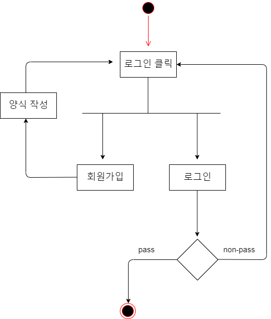
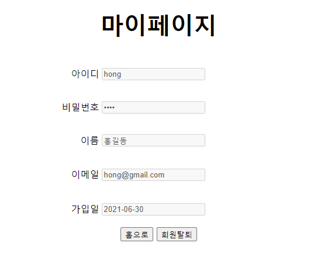

# 첫 게시판 만들기

---

## Intro

---

최근 국비 지원 웹 개발 프로그램에서 자바 서블릿을 중심으로 서버 개발을 공부하고 있습니다.

프로그램 다음 단계인 스프링 프레임워크에 입문하기 전에 지금까지 배운 마크업 언어, js, DB, JSP, Servlet으로 직접 게시판을 구현했습니다.

코드량은 약 1,700줄이며, 교재로 사용 중인 『자바 웹을 다루는 기술』(이병승 저)의 Chap 17 실습 부분을 적극 참고했습니다.

## Tools

---

## Requirements

---

1. 비회원

    - CRUD 모두 불가능, 게시글 클릭 시 로그인 창으로 이동
    - 회원가입 후, 로그인 및 회원 활동 가능

2. 회원

    - 모든 글: Read 가능
    - 게시한 글: CRUD 가능
    - 마이페이지에 탈퇴 가능

    ~~마이페이지에서 정보 변경~~

    ~~모든 글에 대해 댓글을 달 수 있음~~

3. 관리자

    - 모든 글: Read, Delete 가능
    - 관리자는 글을 게시할 수 없음
    - 회원 관리 기능

## UML Diagram

---

1.  액티비티 다이어그램

    -   로그인 기능

        

    -   게시판 기능

        

2.  유스케이스 다이어그램

    

## DB

---

처음 설계할 때 댓글 기능까지 고려하여 모델링했으나, 시간이 부족해서 댓글 테이블은 활용하지 못했습니다..

## 구현 화면

---

1.  비회원

    -   게시판(홈)

        

    -   회원가입 창

        

2.  회원

    -   로그인 창

        

    -   게시판(홈)

        

    -   게시글 조회

        

    -   게시글 작성

        

    -   내 정보 보기

        

3.  관리자

    -   게시판(홈)

        

    -   회원 관리

        

## Outro

---

시간 관계상 게시판에 기본적으로 필요한 기능들을 모두 구현하지 못했고, 코드도 깔끔하지 않습니다..ㅠㅠ 보다 나은 게시판 구현은 스프링을 배우고 난 후로 미루겠습니다! 감사합니다!
